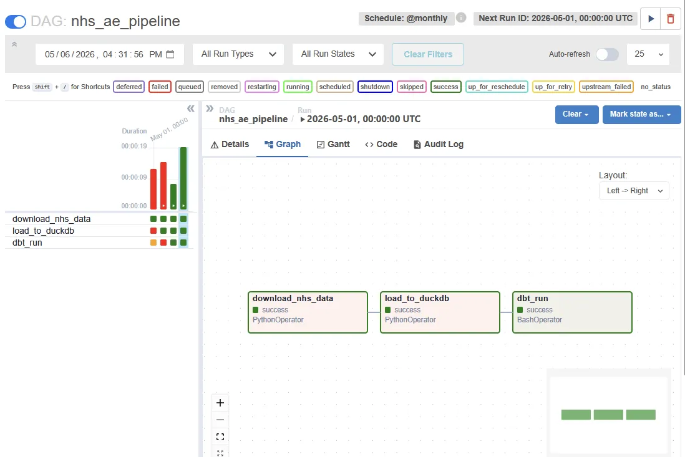
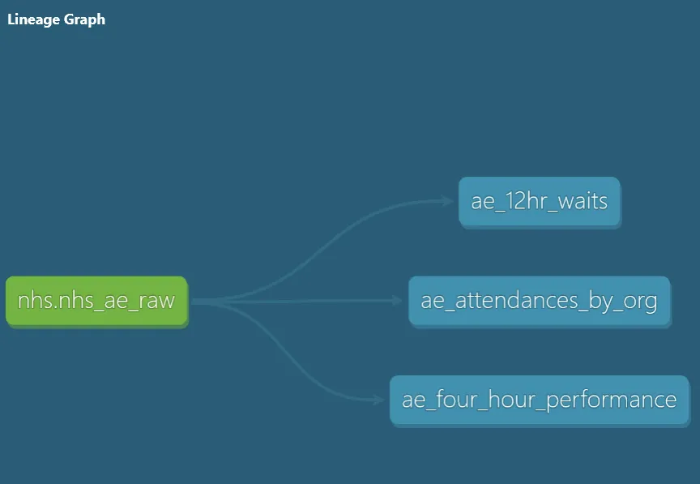

# NHS A&E Analytics Pipeline

An automated data pipeline that downloads monthly NHS England A&E waiting times data, loads it into DuckDB, and transforms it using dbt — orchestrated end to end with Apache Airflow running in Docker.

---

## Architecture

```
NHS England (monthly CSV) → Airflow DAG → DuckDB → dbt → Analytics Views
```

**Pipeline steps:**
1. `download_nhs_data` — fetches the latest monthly A&E CSV from NHS England
2. `load_to_duckdb` — parses and loads raw data into a local DuckDB database
3. `dbt_run` — runs dbt models and data quality tests against the loaded data

---

## Airflow DAG



Scheduled monthly. All three tasks run sequentially and each step only executes if the previous one succeeds.

---

## dbt Lineage



---

## Project Structure

```
nhs-pipeline/
├── dags/
│   └── nhs_ae_pipeline.py      # Airflow DAG definition
├── data/
│   └── nhs.duckdb              # Local DuckDB database (gitignored)
├── dbt/
│   └── nhs_dbt/                # dbt project
│       └── models/
│           ├── sources.yml
│           ├── schema.yml
│           ├── ae_attendances_by_org.sql
│           ├── ae_four_hour_performance.sql
│           └── ae_12hr_waits.sql
├── docker-compose.yml
└── requirements.txt
```

---

## Models

| Model | Description |
|---|---|
| `ae_attendances_by_org` | Total A&E attendances by organisation, broken down by Type 1, Type 2, and Other |
| `ae_four_hour_performance` | Percentage of Type 1 patients seen within the 4-hour NHS target, by organisation |
| `ae_12hr_waits` | Percentage of patients waiting over 12 hours from decision-to-admit, by organisation |

---

## Data Quality Tests

4 dbt tests across all models covering null checks on key fields and percentage calculations.

```
PASS=4 WARN=0 ERROR=0
```

---

## Data Source

Monthly A&E Attendances and Emergency Admissions data published by NHS England:
https://www.england.nhs.uk/statistics/statistical-work-areas/ae-waiting-times-and-activity/

Updated monthly.

---

## Setup & Reproduction

### Prerequisites
- Docker Desktop
- Python 3.8+
- dbt-duckdb (`pip install dbt-duckdb`)

### 1. Start Airflow

```bash
docker compose up airflow-init
docker compose up -d
```

Airflow UI available at `http://localhost:8080` — login with `admin` / `admin`.

### 2. Update the CSV URL

The NHS England CSV URL changes monthly. Find the latest URL at the link above, and update `NHS_CSV_URL` in `dags/nhs_ae_pipeline.py`.

### 3. Trigger the DAG

In the Airflow UI, find `nhs_ae_pipeline` and click the play button to trigger a manual run. All three tasks should go green.

### 4. Run dbt locally (optional)

```bash
cd dbt/nhs_dbt
dbt run
dbt test
dbt docs serve --port 8081
```

---

## Skills Demonstrated

- **Apache Airflow** — DAG authoring, task dependencies, scheduling, Docker deployment
- **Docker** — multi-container setup with Docker Compose (Airflow + Postgres)
- **dbt** — modular SQL transformations, source definitions, data quality testing
- **DuckDB** — local OLAP database for analytical workloads
- **Python** — data ingestion, pandas, requests
- **NHS open data** — real-world healthcare dataset (A&E waiting times)

---

## Notes

- `nhs.duckdb` and `logs/` are gitignored — run the pipeline to generate them locally.
- The 4-hour target (95% of patients seen within 4 hours) has been an NHS performance benchmark since 2004. As of March 2026 most trusts are significantly below this target.
- This project uses publicly available NHS England data. No patient-level data is involved.
